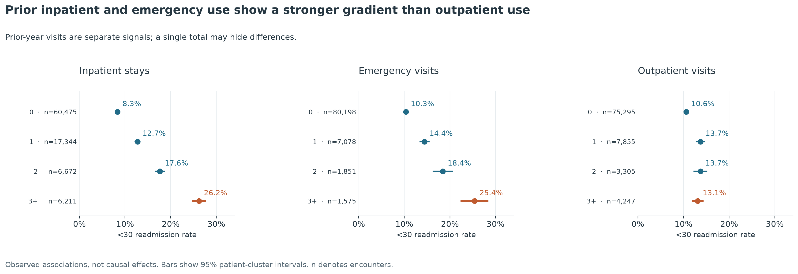
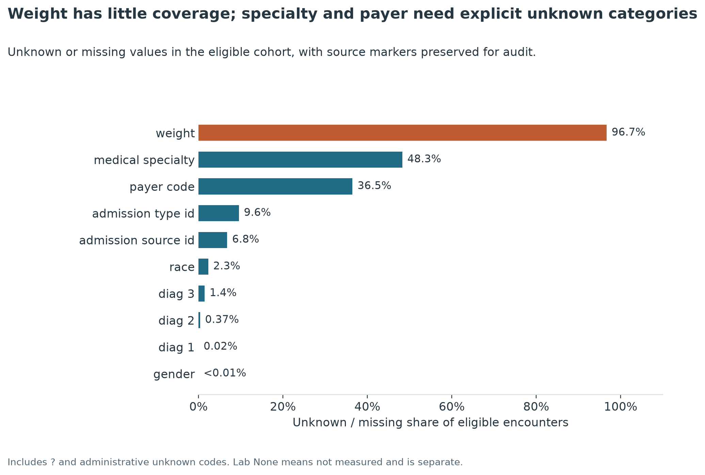
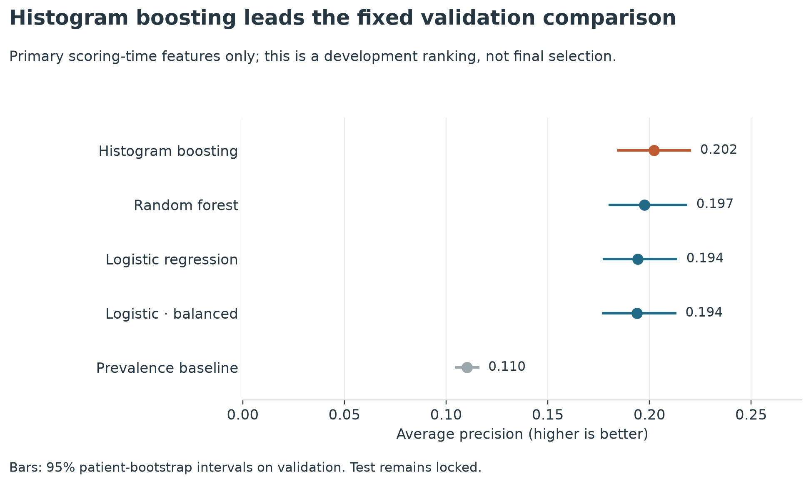

# ReadmitIQ

Predicting hospital readmission risk to help prioritize limited care-management outreach.

**Business question:** Which patients should a hospital prioritize at discharge for follow-up
when its care-management team cannot contact everyone?

**Current status: Phase 3 complete.** The repository contains verified ingestion, an explicit
cohort, executed EDA, frozen patient-grouped partitions and eleven reproducible development
experiments. The final test remains locked and unevaluated. No final model, tuned threshold,
calibrator, intervention-impact claim or prediction service exists.

This is an analytical decision-support portfolio project, not a clinical diagnostic tool.

## Data understanding

| Measure | Raw source | Eligible cohort |
|---|---:|---:|
| Hospital encounters | 101,766 | 90,702 |
| Unique patients | 71,518 | 65,044 |
| `<30` readmission labels | 11,357 (11.16%) | 10,054 (11.08%) |
| Negative labels (`>30` / `NO`) | 90,409 | 80,648 |
| Patients with multiple encounters | 16,773 | 14,563 |
| Encounters from repeat patients | 46.21% | 44.34% |
| Missing weight | 96.86% | 96.68% |
| Missing medical specialty | 49.08% | 48.28% |
| Missing payer code | 39.56% | 36.48% |

The source has 50 columns (47 candidate features, two IDs and the outcome), with zero duplicate
rows or encounter IDs. Raw bytes remain unchanged. The analytical copy retains every original
column, normalizes literal `?` to missing and adds the validated binary target. Lab `None` means
not measured and is preserved. This analytical copy has no learned transformations; Phase 3
preprocessing is fitted separately on training data only.

**Cohort:** remove 11,064 encounters: 1,652 death-coded, 771 hospice, 3,874 continued inpatient
transfers, 87 without confirmed discharge and 4,680 unknown destinations. Hospice requires a
separate care-goal pathway; it is not assumed incapable of readmission. Selected postacute
destinations remain eligible for coordinated outreach. The mixed rehabilitation category and
unknown-destination policy have explicit sensitivity analyses in the
[cohort report](reports/data_quality/cohort_report.md) and reusable rules in
[phase2.yaml](configs/phase2.yaml).

**Observed associations in the eligible cohort:**

- Prior inpatient use: 26.20% readmission for 3+ visits versus 8.34% for none; difference
  **17.85 percentage points** (95% patient-cluster interval 16.44–19.27).
- Prior emergency use: 25.40% for 3+ visits versus 10.34% for none. Outpatient use levels off;
  keep the three counts separate. Exact-count tails are not strictly monotonic.
- Length of stay: 13.44% for 8–14 days versus 9.08% for 1–2 days. Medication-count rates rise
  from 8.61% at 1–9 to 13.00% at 20–29 and level off at 12.79% for 30+.
- Rehabilitation discharges: 27.70% versus 9.30% at home. This is a care-setting association,
  not evidence that changing destination changes risk; mixed rehab settings need workflow review.



**Missingness:** initially omit weight (only 3,013 observed eligible values); retain explicit
Unknown for specialty/payer, with no claim that missingness is random. Preserve lab Not measured
separately. All 50 fields, including timing-sensitive diagnoses, medications and disposition,
are reviewed in the [feature audit](reports/data_quality/feature_audit.md).



**Evaluation design:** repeat patients have a 19.51% encounter readmission rate versus 4.37%
for single-encounter patients. Full-dataset repeat status is future-informed and cannot be a
predictor. Under hypothetical independent encounter allocation, 37.21% of test encounters
would share a patient with training. Phase 3 implements the **70/15/15 split by patient, seed 42**,
with approximate outcome/group-size stratification and zero overlap. Preprocessing fits training
only; test was frozen before modeling. No dates or hospital IDs support temporal/site validation.
Full-cohort EDA already examined outcomes: the frozen test is isolated from subsequent fitting
and tuning, but is not a fully unseen confirmatory sample.

Read the [raw-data report](reports/data_quality/raw_data_report.md),
[executed notebook](notebooks/01_data_understanding.ipynb),
[dataset comparison and limitations](docs/dataset_selection.md), and
[data dictionary](docs/data_dictionary.md).

Phase 2: [executed EDA notebook](notebooks/02_eda.ipynb),
[missingness decisions](reports/data_quality/missingness_strategy.md),
[split design](reports/modeling/split_strategy.md),
[cleaning contract](reports/modeling/cleaning_strategy.md), and
[feature-engineering discovery plan](reports/feature_engineering_plan.md).

Phase 2 validation: **38 tests passed**, all 11 EDA code cells executed with zero error outputs,
and Ruff/environment checks passed. The [verification record](reports/eda/verification.json)
includes raw-integrity checks, table reconciliation and reviewed figure hashes.

## Modeling methodology and development results

Score at **confirmed discharge**, before the outreach list is finalized. Primary inputs are
age band, gender, admission type/source, admitting specialty, confirmed destination, length
of stay and the three provided prior-year utilization counts. The total and any-use indicators
were tested as additions. IDs, targets, future patient aggregates, constants, sparse weight and
race are excluded from predictors; race is retained for audit. Final diagnoses, billing and
full-stay treatment/lab summaries remain separate timing-sensitive experiments.

| Partition | Encounters | Patients | Positives | Prevalence |
|---|---:|---:|---:|---:|
| Train | 63,563 | 45,530 | 7,068 | 11.120% |
| Validation | 13,590 | 9,757 | 1,499 | 11.030% |
| Test (locked) | 13,549 | 9,757 | 1,487 | 10.975% |

Every eligible patient and encounter belongs to one partition. Test counts above are the
allocation diagnostics saved at freeze time, not test performance. Compressed CSV artifacts
are ignored by Git; committed hashes ensure deterministic reproduction without adding a
Parquet dependency. Development loaders reject test access.

Linear models use standardized numeric counts and training-pooled one-hot categories.
Forest uses unscaled counts; histogram boosting uses native categorical splits. Rare levels
are learned from training only, with safe unseen-category handling. Numeric counts are complete,
so no numeric imputer is fitted. Diagnosis ranges are centralized and tested; medication-count
derivations distinguish No from Steady/Up/Down. No future encounter history is fabricated.

**Validation only; fixed first-pass settings:**

| Model | Average precision | ROC-AUC | Brier |
|---|---:|---:|---:|
| Histogram gradient boosting | 0.202 | 0.662 | 0.0945 |
| Random forest | 0.197 | 0.658 | 0.0947 |
| Logistic regression | 0.194 | 0.653 | 0.0951 |
| Logistic, balanced weights | 0.194 | 0.654 | 0.2258 |
| Prevalence baseline | 0.110 | 0.500 | 0.0981 |



Prior utilization adds **0.039 AP** to logistic (95% paired patient-bootstrap interval
0.027–0.055). Adding total/any-use terms beyond raw counts gives **−0.002 AP**, with no
demonstrated improvement; start the next logistic reference from separate raw counts.
Disposition adds 0.014 AP under the confirmed-destination contract. Diagnosis grouping is
more compact than raw coding, but its superiority is not established and timing remains uncertain.

Boosting's gain over matched logistic is modest: **+0.0079 AP** (0.0015–0.0143). Forest's
advantage is inconclusive. Balanced weighting raises recall at the reference threshold 0.50,
but mean predicted risk becomes 46.53% against 11.03% observed, substantially worsening Brier.
At 0.50, boosting detects only 7 of 1,499 events. An operational outreach threshold has **not**
been chosen. These are development findings, not a final production-model declaration.

Read the [executed baseline notebook](notebooks/03_feature_engineering_and_baselines.ipynb),
[scoring-time contract](reports/modeling/scoring_time_contract.md),
[split report](reports/modeling/data_split_report.md),
[feature manifest](reports/modeling/model_feature_manifest.md),
[full comparison and error analysis](reports/modeling/baseline_model_report.md), and
[Phase 4 recommendation](reports/modeling/phase4_recommendation.md).

Phase 3 validation: **93 tests passed** (all 38 existing plus 55 new), all 10 notebook code
cells executed, and Ruff/environment/dependency checks passed. Four charts were visually
reviewed. Reloading all 11 saved pipelines reproduced their validation predictions and metrics;
frozen data hashes stayed unchanged. See the [verification record](reports/modeling/phase3_verification.json).

## Dataset

[UCI Diabetes 130-US Hospitals, 1999–2008](https://doi.org/10.24432/C5230J),
by Clore, Cios, DeShazo and Strack (2014), licensed CC BY 4.0. Chosen after comparing
MIMIC-IV, HCUP NRD and Synthea for target fit, access and reproducibility.
The population is selected inpatient encounters with diabetes, not all hospital patients.

The validated positive label is `readmitted == '<30'`. `>30` and `NO` are negative.
`NO` means no recorded readmission, which does not ensure complete follow-up elsewhere.
The source categories do not allow the exact day-30 boundary to be independently verified.

## Reproduce the executed work

For a fresh checkout, from the repository root on macOS/Linux (Python 3.11+; verified with 3.12.2):

```bash
python3 -m venv .venv
source .venv/bin/activate
python -m pip install -r requirements.txt
python -m pip install --no-deps --no-build-isolation .
make phase1
make phase2
make phase3
```

On Windows, activate with `.venv\Scripts\Activate.ps1` and use the equivalent commands:

```bash
python -m readmit_iq.data.download
python -m readmit_iq.data.inspect
python scripts/execute_notebook.py
python scripts/execute_notebook.py notebooks/02_eda.ipynb
python scripts/execute_notebook.py notebooks/03_feature_engineering_and_baselines.ipynb
python scripts/verify_environment.py
python -m pip check
python -m pytest
```

For this existing workspace, rerun **`make phase3` only**. Once partitions are frozen,
full-cohort Phase 2 EDA is blocked; use its archived notebook/reports. Do not delete the lock
to explore test data. `make split` verifies existing hashes or reconstructs the same assignments
from verified raw data in a fresh checkout; it refuses silent reallocation or overwrite.

`requirements.txt` pins the environment used by all three phases. No Phase 2/3 dependency was added.
Platform-only packages use markers.
Exact pinned versions were tested on Python 3.12/macOS arm64; other Python/platform combinations
are not verified locally. If a pin is unavailable, resolve `python -m pip install '.[dev]'`
in a fresh environment and record a separate lock instead of silently changing this one.
`pyproject.toml` declares direct dependencies and future modeling/API/demo extras. Those extras
are deferred and have not been installed, resolved together or tested. Phase 3 uses installed
scikit-learn estimators; no Optuna, SHAP, SMOTE, MLflow or additional booster package is used.

Use `make download`, `make inspect`, `make notebook`, `make verify`, `make test`, or `make lint`
for Phase 1 steps. `make eda` rebuilds the cohort/reports/figures; `make eda-notebook` executes
the complete Phase 2 analysis and embeds its outputs. `make phase2` executes that notebook,
checks the environment, lints and runs the complete test suite. It expects Phase 1 source files
and reports to exist. To work interactively, run `.venv/bin/jupyter lab`; the Python kernel
must use this project's virtual environment. No global kernel registration is required.
`make notebook` registers the ReadmitIQ kernel inside `.venv` and executes with that interpreter.

`make baselines` runs the fixed development registry and rebuilds its reports/figures.
`make baseline-notebook` executes notebook 03, including those experiments. `make phase3` adds
environment, lint and complete test checks. Model settings and paths live in `configs/phase3.yaml`.
Reviewed report prose is guarded against changed AP/error evidence; new experiments require a
fresh review of conclusions rather than silently retaining the prior narrative.

Source settings live in `configs/config.yaml`; Phase 2 policy lives in `configs/phase2.yaml`.
Source hashes enforce the reviewed release. A changed
download fails verification and requires review. Raw data, `.venv`, credentials, caches and
model files are excluded from Git. No credentials or `.env` are required. Optional overrides
are documented in `.env.example`. The frozen split and estimator seed is 42.

## Structure

```text
configs/                     Source/cohort contracts, frozen split and fixed experiment registry
data/{raw,interim,processed}/ Verified raw; ignored cohort and compressed frozen partitions
docs/                        Dataset selection and source dictionary
notebooks/                   Executed notebooks 01, 02 and 03
src/readmit_iq/data/          Download, load, validate and inspect modules
src/readmit_iq/analysis/      Feature audit, patient-cluster statistics, reports and plots
src/readmit_iq/modeling/      Splits, features, encoders, pipelines, training and validation
reports/data_quality/        Raw checks, cohort report, feature audit and missingness decisions
reports/eda/                 Reproducible descriptive tables and summary JSON
reports/figures/eda/          Seven reviewed EDA figures
reports/modeling/            Frozen manifest, feature policy and validation results
reports/figures/modeling/    Four reviewed modeling figures
scripts/                     Environment verification and notebook execution
tests/                       Source, cohort, split, feature, encoding and model-pipeline checks
models/development/          Ignored experimental pipelines and validation predictions
```

The `src/readmit_iq` package separates imports from the repository root. A regular package
installation is used because this local macOS environment hides editable-install `.pth` files.
After modifying source modules, reinstall with `python -m pip install --no-deps --no-build-isolation .`.
Run commands from the repository root, or set `READMITIQ_CONFIG` to the YAML file's full path.
APIs and future notebooks are not scaffolded.
Docker, advanced ML dependencies and service CI will be added when those phases begin.
Local Git is initialized on `main`; no GitHub remote is configured. The planned remote name
is `readmit-iq`, to be connected when the user creates it.
The GitHub Actions workflow executes all three notebooks, lint and tests on Python 3.12.
It is configured but cannot run remotely until a GitHub repository is connected and pushed.

## Phase 4, pending authorization

Prioritize histogram gradient boosting and logistic regression, based on the validation evidence.
Use patient-grouped training folds for bounded tuning, then examine probability calibration and
an outreach operating policy using development data only. Keep test locked. Resolve live field
arrival times and external validation before operational claims. Random forest is a lower-priority
reference; redundant utilization additions and uncertain encounter summaries have no current
evidence of benefit. These results do not justify automatic resampling.
No later phase starts automatically.
