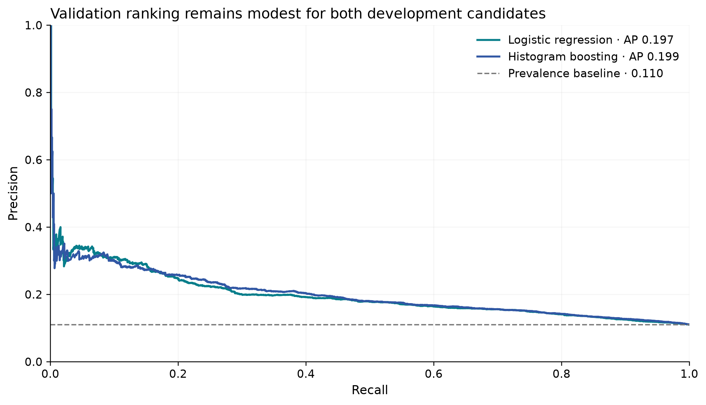

# ReadmitIQ

Predicting hospital readmission risk to help prioritize limited care-management outreach.

**Business question:** Which patients should a hospital prioritize at discharge for follow-up
when its care-management team cannot contact everyone?

**Current status: Phase 4 complete.** Training-only patient-grouped optimization and calibration
comparisons select **uncalibrated logistic regression** as the primary development model, with
**uncalibrated histogram boosting** as challenger. The final test remains locked and unevaluated.
No final operational threshold, production model, intervention-impact claim or prediction service
exists. Model comparisons distinguish training CV from development validation performance.

This is an analytical decision-support portfolio project, not a clinical diagnostic tool.

## Data understanding

| Measure | Raw source | Eligible cohort |
|---|---:|---:|
| Hospital encounters | 101,766 | 90,702 |
| Unique patients | 71,518 | 65,044 |
| `<30` readmission labels | 11,357 (11.16%) | 10,054 (11.08%) |
| Negative labels (`>30` / `NO`) | 90,409 | 80,648 |
| Patients with multiple encounters | 16,773 | 14,563 |
| Encounters from repeat patients | 46.21% | 44.34% |
| Missing weight | 96.86% | 96.68% |
| Missing medical specialty | 49.08% | 48.28% |
| Missing payer code | 39.56% | 36.48% |

The source has 50 columns (47 candidate features, two IDs and the outcome), with zero duplicate
rows or encounter IDs. Raw bytes remain unchanged. The analytical copy retains every original
column, normalizes literal `?` to missing and adds the validated binary target. Lab `None` means
not measured and is preserved. This analytical copy has no learned transformations; Phase 3
preprocessing is fitted separately on training data only.

**Cohort:** remove 11,064 encounters: 1,652 death-coded, 771 hospice, 3,874 continued inpatient
transfers, 87 without confirmed discharge and 4,680 unknown destinations. Hospice requires a
separate care-goal pathway; it is not assumed incapable of readmission. Selected postacute
destinations remain eligible for coordinated outreach. The mixed rehabilitation category and
unknown-destination policy have explicit sensitivity analyses in the
[cohort report](reports/data_quality/cohort_report.md) and reusable rules in
[phase2.yaml](configs/phase2.yaml).

**Observed associations in the eligible cohort:**

- Prior inpatient use: 26.20% readmission for 3+ visits versus 8.34% for none; difference
  **17.85 percentage points** (95% patient-cluster interval 16.44–19.27).
- Prior emergency use: 25.40% for 3+ visits versus 10.34% for none. Outpatient use levels off;
  keep the three counts separate. Exact-count tails are not strictly monotonic.
- Length of stay: 13.44% for 8–14 days versus 9.08% for 1–2 days. Medication-count rates rise
  from 8.61% at 1–9 to 13.00% at 20–29 and level off at 12.79% for 30+.
- Rehabilitation discharges: 27.70% versus 9.30% at home. This is a care-setting association,
  not evidence that changing destination changes risk; mixed rehab settings need workflow review.


**Missingness:** initially omit weight (only 3,013 observed eligible values); retain explicit
Unknown for specialty/payer, with no claim that missingness is random. Preserve lab Not measured
separately. All 50 fields, including timing-sensitive diagnoses, medications and disposition,
are reviewed in the [feature audit](reports/data_quality/feature_audit.md).


**Evaluation design:** repeat patients have a 19.51% encounter readmission rate versus 4.37%
for single-encounter patients. Full-dataset repeat status is future-informed and cannot be a
predictor. Under hypothetical independent encounter allocation, 37.21% of test encounters
would share a patient with training. Phase 3 implements the **70/15/15 split by patient, seed 42**,
with approximate outcome/group-size stratification and zero overlap. Preprocessing fits training
only; test was frozen before modeling. No dates or hospital IDs support temporal/site validation.
Full-cohort EDA already examined outcomes: the frozen test is isolated from subsequent fitting
and tuning, but is not a fully unseen confirmatory sample.

Read the [raw-data report](reports/data_quality/raw_data_report.md),
[executed notebook](notebooks/01_data_understanding.ipynb),
[dataset comparison and limitations](docs/dataset_selection.md), and
[data dictionary](docs/data_dictionary.md).

Phase 2: [executed EDA notebook](notebooks/02_eda.ipynb),
[missingness decisions](reports/data_quality/missingness_strategy.md),
[split design](reports/modeling/split_strategy.md),
[cleaning contract](reports/modeling/cleaning_strategy.md), and
[feature-engineering discovery plan](reports/feature_engineering_plan.md).

Phase 2 validation: **38 tests passed**, all 11 EDA code cells executed with zero error outputs,
and Ruff/environment checks passed. The [verification record](reports/eda/verification.json)
includes raw-integrity checks, table reconciliation and reviewed figure hashes.

## Modeling methodology and development results

Score at **confirmed discharge**, before the outreach list is finalized. Primary inputs are
age band, gender, admission type/source, admitting specialty, confirmed destination, length
of stay and the three provided prior-year utilization counts. The total and any-use indicators
were tested as additions. IDs, targets, future patient aggregates, constants, sparse weight and
race are excluded from predictors; race is retained for audit. Final diagnoses, billing and
full-stay treatment/lab summaries remain separate timing-sensitive experiments.

| Partition | Encounters | Patients | Positives | Prevalence |
|---|---:|---:|---:|---:|
| Train | 63,563 | 45,530 | 7,068 | 11.120% |
| Validation | 13,590 | 9,757 | 1,499 | 11.030% |
| Test (locked) | 13,549 | 9,757 | 1,487 | 10.975% |

Every eligible patient and encounter belongs to one partition. Test counts above are the
allocation diagnostics saved at freeze time, not test performance. Compressed CSV artifacts
are ignored by Git; committed hashes ensure deterministic reproduction without adding a
Parquet dependency. Development loaders reject test access.

Linear models use standardized numeric counts and training-pooled one-hot categories.
Forest uses unscaled counts; histogram boosting uses native categorical splits. Rare levels
are learned from training only, with safe unseen-category handling. Numeric counts are complete,
so no numeric imputer is fitted. Diagnosis ranges are centralized and tested; medication-count
derivations distinguish No from Steady/Up/Down. No future encounter history is fabricated.

**Phase 3 validation only; fixed first-pass settings:**

| Model | Average precision | ROC-AUC | Brier |
|---|---:|---:|---:|
| Histogram gradient boosting | 0.202 | 0.662 | 0.0945 |
| Random forest | 0.197 | 0.658 | 0.0947 |
| Logistic regression | 0.194 | 0.653 | 0.0951 |
| Logistic, balanced weights | 0.194 | 0.654 | 0.2258 |
| Prevalence baseline | 0.110 | 0.500 | 0.0981 |


Prior utilization adds **0.039 AP** to logistic (95% paired patient-bootstrap interval
0.027–0.055). Adding total/any-use terms beyond raw counts gives **−0.002 AP**, with no
demonstrated improvement; start the next logistic reference from separate raw counts.
Disposition adds 0.014 AP under the confirmed-destination contract. Diagnosis grouping is
more compact than raw coding, but its superiority is not established and timing remains uncertain.

Boosting's gain over matched logistic is modest: **+0.0079 AP** (0.0015–0.0143). Forest's
advantage is inconclusive. Balanced weighting raises recall at the reference threshold 0.50,
but mean predicted risk becomes 46.53% against 11.03% observed, substantially worsening Brier.
At 0.50, boosting detects only 7 of 1,499 events. An operational outreach threshold has **not**
been chosen. These are development findings, not a final production-model declaration.

Read the [executed baseline notebook](notebooks/03_feature_engineering_and_baselines.ipynb),
[scoring-time contract](reports/modeling/scoring_time_contract.md),
[split report](reports/modeling/data_split_report.md),
[feature manifest](reports/modeling/model_feature_manifest.md),
[full comparison and error analysis](reports/modeling/baseline_model_report.md), and
[Phase 4 recommendation](reports/modeling/phase4_recommendation.md).

Phase 3 validation: **93 tests passed** (all 38 existing plus 55 new), all 10 notebook code
cells executed, and Ruff/environment/dependency checks passed. Four charts were visually
reviewed. Reloading all 11 saved pipelines reproduced their validation predictions and metrics;
frozen data hashes stayed unchanged. See the [verification record](reports/modeling/phase3_verification.json).

## Phase 4 optimization and development selection

Five `StratifiedGroupKFold` folds use seed 42 and deterministic encounter ordering within the
63,563 training encounters. Every patient's encounters stay in one fold; all fit/holdout overlaps
are zero. Preprocessing fits inside training folds. AP is primary because positive prevalence is
about 11%; a constant-score baseline has AP equal to prevalence. Fold SD describes variability,
not an independent confidence interval. Feature selection and tuning reuse folds, so selected
CV scores are optimistic and are not nested-CV performance estimates.

The [protocol](reports/modeling/phase4_protocol.md) and [configuration](configs/phase4.yaml)
were committed before fitting. Sequential seeded Optuna completed **15 logistic and 30 boosting
trials**, stopping at the prespecified training-CV plateau. Maximum budgets were 30 and 50.
Logistic tunes unweighted L2 strength; boosting tunes learning rate, iterations, leaf count,
minimum leaf size and L2. Random forest is one fixed reference. No SMOTE was used.

| Development candidate | CV AP mean ± SD | Validation AP | Validation ROC-AUC | Validation Brier |
|---|---:|---:|---:|---:|
| Logistic — primary | 0.21243 ± 0.00768 | 0.19678 | 0.65459 | 0.095065 |
| Histogram boosting — challenger | 0.22021 ± 0.00527 | 0.19872 | 0.66149 | 0.094604 |
| Fixed forest reference | 0.21760 ± 0.00537 | 0.19969 | 0.66023 | 0.094797 |

Both selected families retain **core allowed inputs + raw utilization counts**. Logistic uses
`C=0.0998815`, L2/lbfgs. Boosting uses `learning_rate=0.0493858`, `max_iter=75`,
`max_leaf_nodes=15`, `min_samples_leaf=50`, `l2_regularization=30`, `max_bins=255`,
with internal early stopping disabled. Exact parameters and fold metrics are in the
[tuning report](reports/modeling/tuning_report.md).

Raw + engineered utilization changed fixed-setting CV AP by −0.00107 for logistic and +0.00097
for boosting; the latter did not clear the prespecified 0.001 complexity margin. Indicators alone
lost about 0.026–0.030 AP. Grouped diagnoses improved boosting's training CV AP by about 0.0053;
raw codes did not. Logistic diagnosis differences were small. Timing remains unverified, so all
diagnosis experiments stay training-only sensitivities and are ineligible for the primary model.

**Tuning did not materially improve Phase 3 validation performance.** Logistic changed by
+0.00037 AP versus the Phase 3 raw-count reference; boosting changed by −0.00346 versus the
Phase 3 booster (which used raw + engineered counts). Both paired intervals include zero.
Parameters were not altered after inspecting validation results.

All seven fitted candidates were sealed before one validation prediction pass. Sigmoid and
isotonic use training-only cross-fitted calibration with patient-disjoint folds. Logistic isotonic
improved Brier by 0.000236 but reduced AP by 0.00600; sigmoid's Brier improvement was negligible.
Neither boosting calibrator qualified. **Both selected models remain uncalibrated** under the
prespecified Brier-improvement, uncertainty and AP-preservation rule. See the
[calibration report](reports/modeling/calibration_report.md).

Boosting's validation AP advantage is **+0.00194**, with a 95% paired patient-bootstrap interval
**[−0.00427, +0.00839]** from 1,000 patient resamples. Its Brier is better, but the AP evidence
does not clear the prespecified complexity margin. Logistic therefore becomes primary; boosting's
better CV stability and Brier support retaining it as challenger. These are development choices,
not equivalence claims or clinical utility estimates.



At illustrative logistic thresholds **0.10 / 0.20**, recall is **60.6% / 16.2%**, precision
**16.3% / 26.8%**, and **41.0% / 6.7%** of validation encounters are flagged. Unique historical
patients flagged are **3,608 / 588**; they are not a simultaneous outreach caseload. No threshold
is selected. At 0.10, recall is 35.2% with no prior inpatient use versus 88.2% with any prior use.
Limited demographic checks retain missingness and suppress small groups; they establish no
fairness or causal conclusion.

Read [notebook 04](notebooks/04_model_optimization.ipynb), the
[development selection report](reports/modeling/model_selection_report.md),
[structured outputs](reports/modeling/phase4/), and
[Phase 5 recommendation](reports/modeling/phase5_recommendation.md).
Local verification: **158 tests passed**, all **13 notebook code cells** executed with zero
errors, six figures visually reviewed, Ruff/dependency checks passed, frozen hashes unchanged,
and saved predictions reused without rescoring. The
[Phase 4 verification record](reports/modeling/phase4/verification.json) records the evidence.

Validation has informed earlier feature development, calibration and model selection. Bootstrap
intervals condition on fitted candidates and exclude retraining/selection uncertainty. Earlier
full-cohort EDA also exposed eventual test outcomes indirectly. These limitations, historical data,
uncertain field arrival times and incomplete outside-hospital follow-up limit generalization.

## Dataset

[UCI Diabetes 130-US Hospitals, 1999–2008](https://doi.org/10.24432/C5230J),
by Clore, Cios, DeShazo and Strack (2014), licensed CC BY 4.0. Chosen after comparing
MIMIC-IV, HCUP NRD and Synthea for target fit, access and reproducibility.
The population is selected inpatient encounters with diabetes, not all hospital patients.

The validated positive label is `readmitted == '<30'`. `>30` and `NO` are negative.
`NO` means no recorded readmission, which does not ensure complete follow-up elsewhere.
The source categories do not allow the exact day-30 boundary to be independently verified.

## Reproduce the executed work

For a fresh checkout, from the repository root on macOS/Linux (Python 3.11+; verified with 3.12.2):

```bash
python3 -m venv .venv
source .venv/bin/activate
python -m pip install -r requirements.txt
python -m pip install --no-deps --no-build-isolation .
make phase1
make phase2
make phase3
make phase4
```

On Windows, activate with `.venv\Scripts\Activate.ps1` and use the equivalent commands:

```bash
python -m readmit_iq.data.download
python -m readmit_iq.data.inspect
python scripts/execute_notebook.py
python scripts/execute_notebook.py notebooks/02_eda.ipynb
python scripts/execute_notebook.py notebooks/03_feature_engineering_and_baselines.ipynb
python scripts/execute_notebook.py notebooks/04_model_optimization.ipynb --timeout 3600
python scripts/verify_environment.py
python -m pip check
python -m pytest --junitxml=.cache/phase4-tests.xml
python scripts/verify_phase4.py
```

For this existing workspace, rerun **`make phase4`** to verify/reuse completed development work.
`make phase3` remains available for baseline reproduction. Once partitions are frozen,
full-cohort Phase 2 EDA is blocked; use its archived notebook/reports. Do not delete the lock
to explore test data. `make split` verifies existing hashes or reconstructs the same assignments
from verified raw data in a fresh checkout; it refuses silent reallocation or overwrite.
CI executes source inspection and EDA first, then explicitly runs `make split` before
`make phase3`, then the complete `make phase4`. Freezing before the EDA notebook would correctly
trigger the test-access guard.
The baseline-notebook target also verifies the split as a prerequisite.

Frozen CSV serialization fixes UTF-8, LF line endings, compression level, zero timestamp and
the original gzip OS header byte (19). Python 3.12 otherwise lets zlib write a host-dependent
OS byte, changing compressed-file hashes without changing patient assignments
([Python gzip documentation](https://docs.python.org/3.12/library/gzip.html#gzip.compress)).
The original manifest, partition hashes and allocation are preserved. Reconstruction is staged
and checked against the entire committed contract before becoming the local frozen split;
a mismatch leaves the manifest untouched and no replacement lock.
Fifteen additional split regression cases cover platform headers, reconstruction and failure
handling; eleven reporting cases protect reviewed conclusions. The suite had 119 tests at the
start of Phase 4, which adds 39 cases. Phase 3 reports retain their original execution results.

`requirements.txt` pins the environment used by all four phases. Phase 4 adds Optuna 5.0.0,
MLflow-skinny 3.16.1 and its local SQLite dependencies without changing earlier package pins.
Platform-only packages use markers.
Exact pinned versions were tested on Python 3.12/macOS arm64; other Python/platform combinations
are not verified locally. If a pin is unavailable, resolve `python -m pip install '.[dev]'`
in a fresh environment and record a separate lock instead of silently changing this one.
`pyproject.toml` declares direct dependencies, optimization extras and future modeling/API/demo
extras. The broad future extras are deferred and have not been resolved together or tested.
Phase 3 uses scikit-learn estimators. Phase 4 adds Optuna/local MLflow; no SHAP, SMOTE,
additional booster package, API or deployment is implemented. Some web packages are transitive
MLflow dependencies, not an application service.

Use `make download`, `make inspect`, `make notebook`, `make verify`, `make test`, or `make lint`
for Phase 1 steps. `make eda` rebuilds the cohort/reports/figures; `make eda-notebook` executes
the complete Phase 2 analysis and embeds its outputs. `make phase2` executes that notebook,
checks the environment, lints and runs the complete test suite. It expects Phase 1 source files
and reports to exist. To work interactively, run `.venv/bin/jupyter lab`; the Python kernel
must use this project's virtual environment. No global kernel registration is required.
`make notebook` registers the ReadmitIQ kernel inside `.venv` and executes with that interpreter.

`make baselines` runs the fixed development registry and rebuilds its reports/figures.
`make baseline-notebook` executes notebook 03, including those experiments. `make phase3` adds
environment, lint and complete test checks. Model settings and paths live in `configs/phase3.yaml`.
Reviewed report prose is guarded against changed AP/error evidence; new experiments require a
fresh review of conclusions rather than silently retaining the prior narrative.
The [CI reproduction review](reports/modeling/ci_reproduction_review.md) records the small
random-forest difference observed between macOS arm64 and Linux x86_64. Both reviewed AP values
are explicitly recognized with the original numerical tolerance; other changes still require
review. Forest comparison prose uses the current paired estimate and interval, and checks that
its ranking, inconclusive interval and default-threshold confusion counts remain unchanged.

`make optimize` performs or verifies training-only searches and sealed candidate fits.
`make optimization-reports` scores the fixed candidates once on validation, or verifies/reuses
their cached predictions, then rebuilds aggregate reports and figures. `make optimization-notebook`
executes the complete Phase 4 workflow; `make phase4` adds artifact/environment verification,
lint and the full test suite. It requires the existing frozen split and Phase 3 reference artifacts.
Missing or changed splits fail; Phase 4 never reconstructs them. Changed training code, policy,
dependencies, model bytes or prediction bytes cannot silently reuse the prior comparison.
Do not delete seals/caches to reopen tuning after validation has informed selection.

MLflow runs are local to ignored `mlruns/phase4/tracking.sqlite`, with explicit local tracking
and registry URIs, no credentials, no server and no raw-data uploads. Run IDs, parameters,
CV/final metrics, Git revision, seed and development artifact paths are recorded. Inspect locally:

```python
from pathlib import Path
from mlflow.tracking import MlflowClient

uri = "sqlite:///" + str(Path("mlruns/phase4/tracking.sqlite").resolve())
client = MlflowClient(tracking_uri=uri, registry_uri=uri)
experiment = client.get_experiment_by_name("ReadmitIQ-Phase4")
runs = client.search_runs([experiment.experiment_id])
```

Source settings live in `configs/config.yaml`; Phase 2 policy lives in `configs/phase2.yaml`.
Source hashes enforce the reviewed release. A changed
download fails verification and requires review. Raw data, `.venv`, credentials, caches and
model files are excluded from Git. No credentials or `.env` are required. Optional overrides
are documented in `.env.example`. The frozen split and estimator seed is 42.

## Structure

```text
configs/                     Source/cohort contracts, split, baseline and optimization policies
data/{raw,interim,processed}/ Verified raw; ignored cohort and compressed frozen partitions
docs/                        Dataset selection and source dictionary
notebooks/                   Executed notebooks 01–04
src/readmit_iq/data/          Download, load, validate and inspect modules
src/readmit_iq/analysis/      Feature audit, patient-cluster statistics, reports and plots
src/readmit_iq/modeling/      Splits, features, encoders, pipelines, training and validation
src/readmit_iq/optimization/  Group CV, Optuna, calibration, local tracking and development selection
reports/data_quality/        Raw checks, cohort report, feature audit and missingness decisions
reports/eda/                 Reproducible descriptive tables and summary JSON
reports/figures/eda/          Seven reviewed EDA figures
reports/modeling/            Frozen manifest, feature policy and validation results
reports/figures/modeling/    Four baseline figures plus six Phase 4 figures
scripts/                     Environment verification and notebook execution
tests/                       Source, cohort, split, feature, encoding and model-pipeline checks
models/development/          Ignored experimental pipelines and validation predictions
mlruns/phase4/               Ignored local SQLite experiment tracking
```

The `src/readmit_iq` package separates imports from the repository root. A regular package
installation is used because this local macOS environment hides editable-install `.pth` files.
After modifying source modules, reinstall with `python -m pip install --no-deps --no-build-isolation .`.
Run commands from the repository root, or set `READMITIQ_CONFIG` to the YAML file's full path.
APIs and future notebooks are not scaffolded.
Docker and service CI remain deferred.
The GitHub repository is [Ajay0612/readmit-iq](https://github.com/Ajay0612/readmit-iq),
with `main` as the development branch and `origin` as the local remote.
Only project source, configuration, tests, documentation, executed notebooks, aggregate reports
and figures are versioned; downloaded data, processed partitions, development models and local
environment files stay outside Git.
The GitHub Actions workflow executes all four notebooks, the full bounded search, lint and tests
on Python 3.12
for pushes and pull requests. See [workflow runs](https://github.com/Ajay0612/readmit-iq/actions)
for remote execution status. Earlier verification reports describe their original execution state.

## Phase 5, pending authorization

Carry logistic primary and boosting challenger forward under the frozen confirmed-discharge
contract. Investigate low-utilization errors, subgroup calibration and missingness; verify actual
field-arrival times. Establish intervention capacity and error costs before selecting a threshold.
Plan responsible explanations and contemporary external validation. Any final test evaluation
requires a separately authorized, frozen evaluation plan. No later phase starts automatically.
