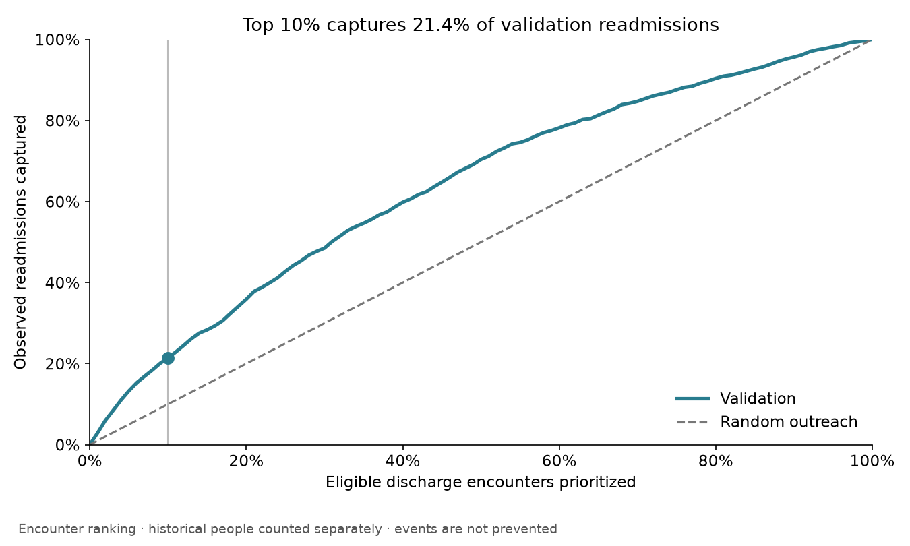
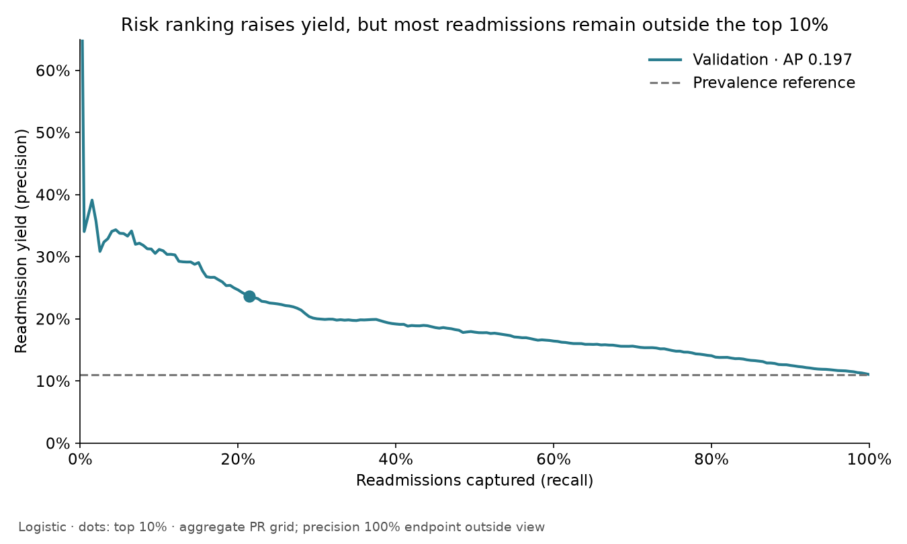
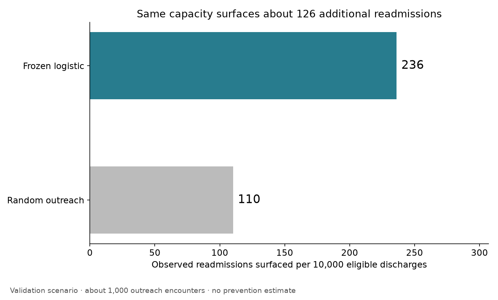
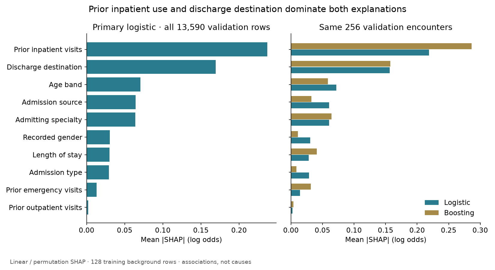
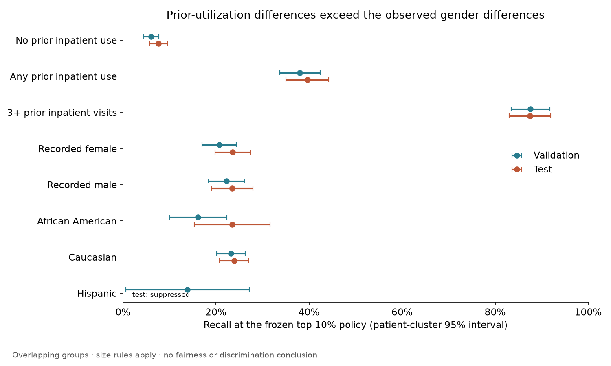
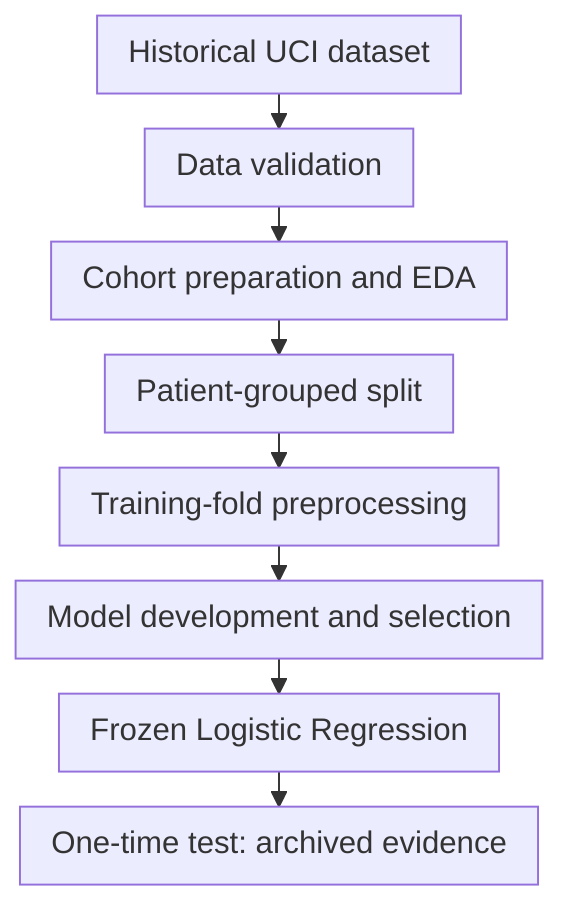
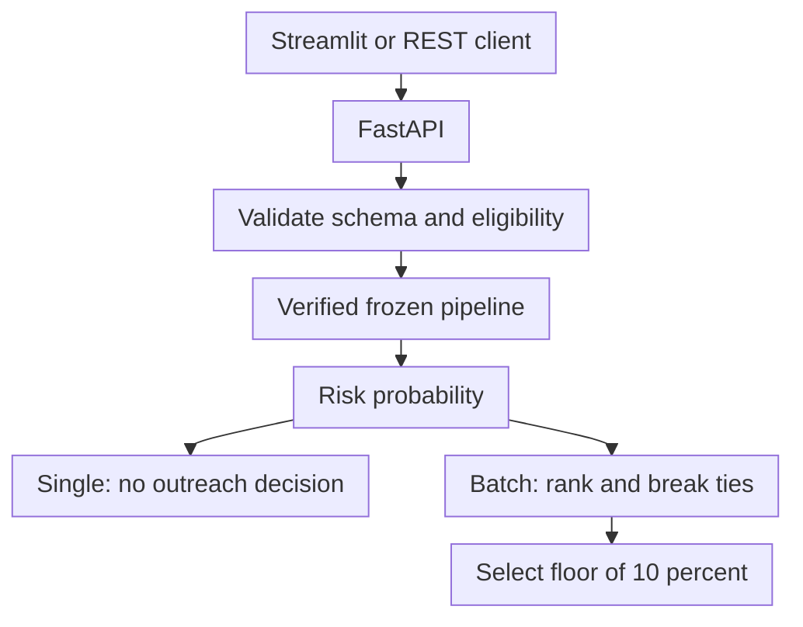

# ReadmitIQ

**Predicting 30-Day Hospital Readmission Risk to Prioritize Care-Management Outreach**

When follow-up capacity is limited, which discharge encounters should a care-management team
review first? ReadmitIQ connects a patient-grouped modeling study to an explicit outreach
capacity scenario and a tested local FastAPI/Streamlit demonstration. It combines statistical
evaluation, explainability and error analysis with a frozen inference pipeline.

**The result:** prioritizing the highest-risk **10%** of eligible discharge encounters
identified **23.54%** of recorded readmissions, achieving **2.36× lift** over random targeting.
This is a retrospective portfolio scenario: surfaced events, not prevented readmissions.

[](https://github.com/Ajay0612/readmit-iq/actions/workflows/ci.yml)

[Results](#at-a-glance) · [Business impact](#business-impact) · [Methodology](#methodology)
· [Demo walkthrough](docs/demo_walkthrough.md) · [Case study](docs/project_case_study.md)
· [Run locally](#installation-and-reproduction)

## At a glance

| Scope / metric | Verified result |
|---|---:|
| Eligible historical encounters | **90,702** |
| Patients | **65,044** |
| Final test encounters | 13,549 |
| Average precision (AP) | **0.20837** |
| ROC-AUC | **0.65181** |
| Brier score | 0.094101 |
| Recall at top 10% | **23.54%** |
| Precision at top 10% | **25.85%** |
| Lift over random targeting | **2.36×** |

Metrics are **retrospective held-out test results** for the frozen logistic model. Patient
overlap across train/validation/test is zero. Earlier full-cohort EDA means this was not a
fully untouched confirmatory study. [Final report and uncertainty](reports/modeling/final_test_report.md).

**Important failure mode:** recall was **7.6% without prior inpatient use**, versus **39.6%
with prior use**. Low scores do not establish low clinical need. Historical 1999–2008 data
and unresolved workflow/validation gaps rule out claims of clinical readiness.

## Business problem and solution

The practical question is how to allocate a limited review queue. The project estimates
recorded readmission risk after discharge destination is confirmed, then ranks an available
batch under an **assumed 10% outreach capacity**. That assumption is not a hospital policy.

The work spans source validation, cohort/feature auditing, EDA, group-aware model development,
uncertainty analysis, explainability, business interpretation and API packaging. The final
model is uncalibrated logistic regression with ten approved predictors. The local demo uses
the original model and training-fitted preprocessing; it does not train a replacement.

## Key findings

**A small review queue concentrates events, but misses most readmissions.** The frozen test
policy selected 1,354 encounters and surfaced 350 of 1,487 recorded readmissions. The remaining
1,137 events were outside that queue.

[](reports/figures/phase5/02_cumulative_gains.png)

*Validation and final-test gains. Dots mark 10% capacity; the dashed line is random targeting.
Encounter counts are not simultaneous caseload. Select any chart to view its original.*

**Risk estimates support ranking, not diagnosis.** Test AP was 0.20837 against approximately
11% prevalence. Precision at the chosen capacity was 25.85%: most selected encounters still
had no recorded readmission.

[](reports/figures/phase5/01_precision_recall.png)

*Dots identify the capacity policy, not a universal probability threshold. These are saved
curves; final-test predictions were not rerun for this presentation.*

## Methodology

| Decision | Implementation and reasoning |
|---|---|
| Cohort and target | UCI diabetes inpatient encounters; `<30` is positive, `>30`/`NO` negative. Apply documented discharge exclusions. |
| Evaluation units | Patient-grouped train/validation/test: **63,563 / 13,590 / 13,549 encounters**, with zero patient overlap. |
| Predictors | Stay length; prior inpatient, emergency and outpatient counts; age, gender, admission type/source, discharge destination and specialty. |
| Preprocessing | Training-fitted scaling, missing-category normalization, rare-category pooling and encoding, fitted inside each training fold. |
| Development | Prevalence baseline, logistic regression, random forest and histogram gradient boosting; five patient-disjoint training CV folds and bounded Optuna searches. |
| Selection | AP, paired patient-bootstrap uncertainty, Brier/calibration, complexity and a prespecified primary/challenger rule. |
| Final evaluation | Commit the model/policy protocol first; score the held-out test once; preserve aggregate publication hashes. |

IDs, outcomes and future patient aggregates never enter the feature matrix. Race is audit-only;
diagnoses, medication/lab fields and payer are excluded from the final model. The extract cannot
verify workflow arrival times. [Feature policy](reports/modeling/final_feature_policy.md)
· [Split contract](reports/modeling/data_split_report.md).

### Why logistic regression?

Boosting's validation AP advantage was only **+0.00194**, with a paired patient-bootstrap 95%
interval of **−0.00427 to +0.00839**. It had better Brier and CV stability, but did not clear the
prespecified AP/uncertainty margin for greater complexity. Logistic offered similar
discrimination and simpler interpretation; **this is not a statistical-equivalence claim**.

Class weighting worsened probability quality in baseline experiments. Sigmoid calibration
provided negligible improvement; logistic isotonic calibration improved Brier slightly but
reduced AP by 0.00600. Neither met the retention rule. The frozen primary retains L2/lbfgs,
`C=0.09988151348099303`, seed 42, no class weights and no recalibration.
[Selection](reports/modeling/model_selection_report.md) · [Calibration](reports/modeling/calibration_report.md).

## Business impact

At the observed test mix, **10,000 eligible discharges** and about **1,000 outreach encounters**
surface approximately **258 recorded readmissions versus 110 under random targeting**—about
**149 additional surfaced events** at the same assumed capacity.

[](reports/figures/phase5/04_operational_scenario.png)

*Retrospective encounter-level yield, scaled from the archived test result. This estimates
neither prevention, savings, intervention effectiveness nor unique people contacted.*

The rule is exact: rank unrounded risk, apply the original SHA-256 tie-break, and select
`floor(0.10 × N)`. Fewer than ten encounters select zero. A single score has no batch-relative
outreach decision. [Policy](reports/modeling/operational_policy_report.md)
· [Scenario calculation](reports/modeling/phase5/test/business_scenario.json).

## Explainability

**Prior inpatient use and discharge destination are the strongest documented drivers.** Age,
admission source and specialty also contribute. The model combines encounter information
through additive effects on log odds, then converts the result to a probability.

[](reports/figures/phase5/05_global_feature_influence.png)

*Validation explanations: logistic SHAP across validation on the left; a shared 256-encounter
comparison on the right. These explain associations, not causes or treatment effects.*

The [explainability report](reports/modeling/explainability_report.md) includes existing anonymous
validation illustrations. Those are historical analytical examples; the separate demo examples
are hand-authored synthetic records.

## Limitations that affect the decision

**The model misses many readmissions without recorded inpatient history.** That group contains
half of final-test readmissions, yet recall is only 7.6%. Of its 57 captured events, 56 involve
rehabilitation destination code 22. This dependence deserves investigation, not reassurance.

[](reports/figures/phase5/07_subgroup_recall.png)

*Original group definitions and suppression rules remain fixed. Groups overlap; small groups
and wide intervals prevent fairness or subgroup-calibration certification.*

Other limits include the selected **1999–2008 diabetes population**, incomplete outside-hospital
follow-up, unavailable temporal/site validation, unverified feature timing, earlier full-cohort
EDA, and no prospective intervention evidence. Bootstrap intervals omit retraining/selection
uncertainty. This is a **portfolio demonstration, not a clinically validated system**. No claim
of HIPAA compliance is made. [Model card](docs/model_card.md)
· [Responsible ML assessment](reports/responsible_ml.md).

## Interactive demonstration

Explore the [two-minute walkthrough](docs/demo_walkthrough.md), including a short recording
of the running local application using **synthetic inputs only**. There is no public inference
deployment. Running it yourself requires the trusted frozen model artifact.

Streamlit calls FastAPI for single risk estimates or CSV batch ranking. A single response has
`outreach_selected: null`; the bundled 20-record batch selects two. Swagger documents strict
input/eligibility validation and sanitized errors. Docker separates the API and UI; startup
verifies model bytes. API limits are 1,000 records / 1 MiB.

**Engineering evidence:** 296 local tests passed in Phase 6, including four real-artifact
integration tests. Synthetic service/direct-pipeline probabilities matched exactly. CI uses
explicit contract doubles, builds both images and rejects missing artifacts; it does not claim
to possess the ignored model. [Serving verification](reports/serving/phase6_verification.md).

## Architecture

**Analytical development — completed and frozen**


```mermaid
---
config:
  flowchart:
    rankSpacing: 18
    padding: 8
    wrappingWidth: 280
---
flowchart TD
    A[Historical UCI dataset] --> B[Data validation]
    B --> C[Cohort preparation and EDA]
    C --> D[Patient-grouped split]
    D --> E[Training-fold preprocessing]
    E --> F[Model development and selection]
    F --> G[Frozen Logistic Regression]
    G --> H[One-time test: archived evidence]
```

**Serving — consumes the frozen artifact**


```mermaid
---
config:
  flowchart:
    rankSpacing: 18
    padding: 8
    wrappingWidth: 240
---
flowchart TD
    A[Streamlit or REST client] --> B[FastAPI]
    B --> C[Validate schema and eligibility]
    C --> D[Verified frozen pipeline]
    D --> E[Risk probability]
    E --> F[Single: no outreach decision]
    E --> G[Batch: rank and break ties]
    G --> H[Select floor of 10 percent]
```

## Installation and reproduction

**Explore without installing:** all six [executed notebooks](notebooks/) and aggregate reports
are committed. Start with the [case study](docs/project_case_study.md) or
[final evaluation](notebooks/06_final_test_evaluation.ipynb).

**Run the API locally** with Python **3.12**, from a clone:

```bash
python3.12 -m venv .venv
.venv/bin/python -m pip install -r requirements-serving.txt
.venv/bin/python -m pip install --no-deps --no-build-isolation .
# Restore the original trusted model to models/final/readmit_iq_logistic.joblib.
make verify-model
make api
```

The binary is excluded from Git. **A fresh clone alone cannot run real-model inference.**
Obtain the original artifact from the owner or a trusted Phase 5 backup; do not retrain a
replacement or change its expected hash. [Exact setup](docs/local_demo.md).

| Explore | Commands after prerequisites |
|---|---|
| API and Swagger | `make api` → `http://localhost:8000/docs` on your machine |
| Streamlit, separate terminal | `make install-demo`, then `make demo` → `http://localhost:8501` |
| Docker API + UI | Stop native servers; `make docker-build`, then `make docker-run`; stop with `make docker-stop` |
| Serving tests | `make install-phase6`, then `make phase6-test` |
| Complete local engineering verification | `make install-phase6`, `make install-demo`, then `make phase6` with the original artifact |

Keep `.venv` and `.venv-demo` separate: the UI's Arrow dependency changes pandas string storage
and breaks historical split tests if merged. Frozen requirements and evaluation guards remain
intact. Do not rerun full-cohort EDA after freezing or execute `make final-eval` again. CI checks
archived final evidence without repeating its prediction pass.

## Documentation

| Reader goal | Start here |
|---|---|
| Understand analytical choices | [Case study](docs/project_case_study.md) |
| Explore the app in two minutes | [Synthetic demo walkthrough](docs/demo_walkthrough.md) |
| Prepare for an interview | [Interview walkthrough](docs/interview_walkthrough.md) |
| Review career-facing summaries | [Resume bullets](docs/resume_bullets.md) · [Portfolio descriptions](docs/portfolio_description.md) |
| Audit the model | [Model card](docs/model_card.md) · [Specification](reports/modeling/final_model_specification.json) · [Pretest protocol](reports/modeling/final_evaluation_protocol.md) |
| Inspect data and analysis | [Dataset selection](docs/dataset_selection.md) · [Data dictionary](docs/data_dictionary.md) · [Notebooks](notebooks/) |
| Reproduce engineering | [Local setup/API contract](docs/local_demo.md) · [Phase 6 evidence](reports/serving/phase6_verification.md) · [Portfolio audit](reports/portfolio/phase7_audit.md) |
| Follow earlier decisions | [Historical development record](docs/development_history.md) |

**Data attribution:** [UCI Diabetes 130-US Hospitals, 1999–2008](https://doi.org/10.24432/C5230J),
Clore, Cios, DeShazo and Strack (2014); CC BY 4.0, as recorded in the dataset selection document.
**Repository code:** no LICENSE file has been selected; the dataset's license does not establish
a license for this code. The repository owner must choose one.

For reproduction questions or proposed changes, open an issue with the command, environment
and a synthetic example. Do not attach patient data, credentials or model binaries.
