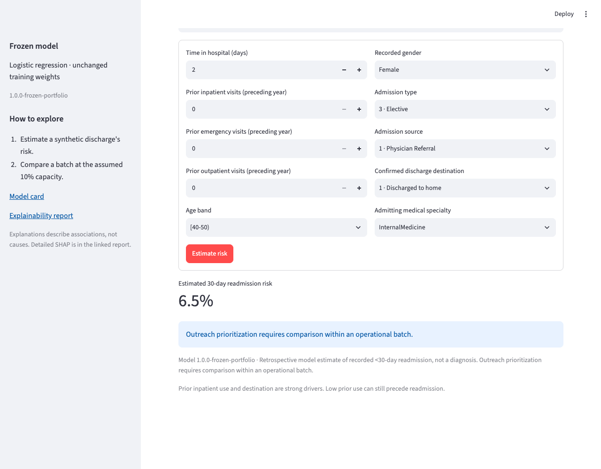
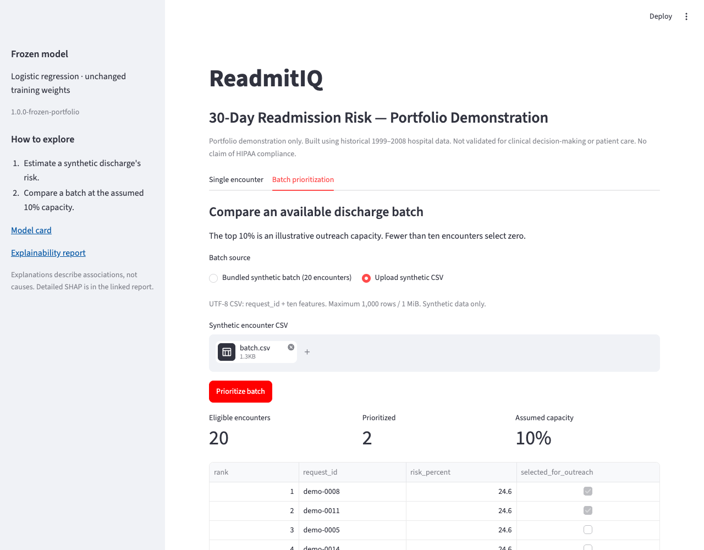

# A two-minute ReadmitIQ demonstration

This is a **local portfolio demonstration** using hand-authored synthetic records. The model
was developed from historical 1999–2008 data and is not validated for patient care. No public
demo endpoint or HIPAA compliance is claimed.

## Watch without installing

[Watch the short synthetic demonstration recording](media/readmitiq-demo.webm).
It shows the actual local Streamlit application calling FastAPI. The recording is an abridged
walkthrough with no narration; the steps below provide its accessible text alternative.

## Before a live walkthrough

Follow [local setup](local_demo.md) to restore the trusted frozen artifact and verify it.
A fresh clone alone cannot perform real-model inference. Keep API and Streamlit environments
separate, or start the existing Docker services with `make docker-run` after building them.
The URLs below refer to the presenter's computer; they are not public deployments.

## Walkthrough

| Time | Action | What to explain |
|---|---|---|
| 0:00–0:20 | Open `http://localhost:8501` and the **Single encounter** tab. | “This is a historical model packaged as a local portfolio demonstration.” |
| 0:20–0:40 | Choose **Lower prior utilization**, review its synthetic fields, and click **Estimate risk**. | The supplied example returns about **6.5%** estimated risk. This is a retrospective model estimate, not a diagnosis. |
| 0:40–0:55 | Point to the batch-context message. | A single record has no top-10% decision because the other encounters in the batch are unknown. |
| 0:55–1:20 | Open **Batch prioritization**, choose **Upload synthetic CSV**, and upload [batch.csv](../examples/synthetic/batch.csv). | The file contains 20 hand-authored encounters with repeated patterns and synthetic tracking IDs. No outcomes or patient identifiers are needed. |
| 1:20–1:40 | Click **Prioritize batch** and inspect the ranked table and chart. | Exactly **two of 20** are selected. Risk is ranked before rounding; tied scores use the original deterministic rule. |
| 1:40–2:00 | Connect the demonstration to the archived gains chart in the README. | “On the held-out historical cohort, this assumed capacity surfaced 23.54% of recorded events. It does not establish prevention, savings or clinical utility.” |

The bundled batch button is an equivalent shortcut to uploading the CSV. Fewer than ten
encounters correctly select zero; the demonstration never rounds the capacity up. Examples
with prior use or rehabilitation context illustrate model associations, not causal advice.

## Optional technical extension

Open Swagger at `http://localhost:8000/docs`. Inspect `/v1/model`, send the synthetic
`/v1/predict` example, and show that `outreach_selected` is null. `/v1/predict/batch` preserves
input order; `/v1/prioritize` returns ranks and selection flags. The local guide contains tested
curl examples and the exact field/eligibility contract.

The API checks model bytes and runtime compatibility at startup. The UI does not load a second
model. An invalid or ineligible record rejects the entire batch before inference; the service
does not silently drop it. Logs omit request payloads and tracking IDs.

If the API is unavailable, check `/health` and `make verify-model`. Restore the original trusted
artifact if needed; do not train a replacement or bypass verification. Stop Docker with
`make docker-stop` after a live presentation.
