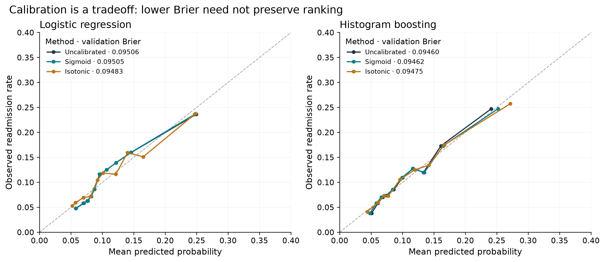

# Phase 4 calibration report

All external metrics are **validation performance** on the frozen 13,590 encounters / 9,757 patients. Test has not been scored. Hyperparameters and feature configurations were selected from training-only patient-grouped CV before validation was opened. See [the prespecified protocol](phase4_protocol.md).

For each tuned family, sigmoid and isotonic calibration use CalibratedClassifierCV with the same explicit five patient-disjoint training folds and ensemble=False. Out-of-fold responses fit the calibrator; the base pipeline then fits all training rows. No validation labels enter either fit. Hyperparameters were selected using the same training population, so OOF responses are conditional on that selection.

Reported CV metrics refer to the uncalibrated base estimator's tuning folds, not an independent CV evaluation of the complete calibration-selection procedure. Calibration methods are compared once on the external development validation set.

| model | average_precision | roc_auc | brier | mean_probability | prevalence |
| --- | --- | --- | --- | --- | --- |
| logistic__uncalibrated | 0.196781 | 0.654593 | 0.095065 | 0.109141 | 0.110302 |
| logistic__sigmoid | 0.196781 | 0.654593 | 0.095055 | 0.109145 | 0.110302 |
| logistic__isotonic | 0.190778 | 0.653456 | 0.094829 | 0.109432 | 0.110302 |
| boosting__uncalibrated | 0.198721 | 0.661488 | 0.094604 | 0.109478 | 0.110302 |
| boosting__sigmoid | 0.198721 | 0.661488 | 0.094620 | 0.109815 | 0.110302 |
| boosting__isotonic | 0.192512 | 0.660597 | 0.094748 | 0.109779 | 0.110302 |

| model | reference | ap_difference | brier_difference | ap_ci_low | ap_ci_high | brier_ci_low | brier_ci_high |
| --- | --- | --- | --- | --- | --- | --- | --- |
| logistic__sigmoid | logistic__uncalibrated | 0.000000 | -0.000010 | 0.000000 | 0.000000 | -0.000023 | 0.000003 |
| logistic__isotonic | logistic__uncalibrated | -0.006002 | -0.000236 | -0.008254 | -0.003832 | -0.000432 | -0.000056 |
| boosting__sigmoid | boosting__uncalibrated | 0.000000 | 0.000016 | 0.000000 | 0.000000 | -0.000049 | 0.000072 |
| boosting__isotonic | boosting__uncalibrated | -0.006210 | 0.000144 | -0.008237 | -0.004263 | 0.000021 | 0.000264 |

Retain calibration only when Brier improves by at least 0.0001, the paired Brier interval is wholly below zero, and AP loss is <=0.001. If both qualify, choose the lower Brier. This rule is fixed in configs/phase4.yaml.

- Logistic regression retains **uncalibrated**.
- Histogram boosting retains **uncalibrated**.

Isotonic may improve squared probability error while creating ties and reducing ranking precision; the table reports both consequences. Sigmoid need not improve probability error even when it preserves rank. No method is preferred by reputation. Mean-probability agreement alone is not evidence of complete calibration. Quantile curves have no uncertainty bands; Brier mixes calibration and discrimination.

